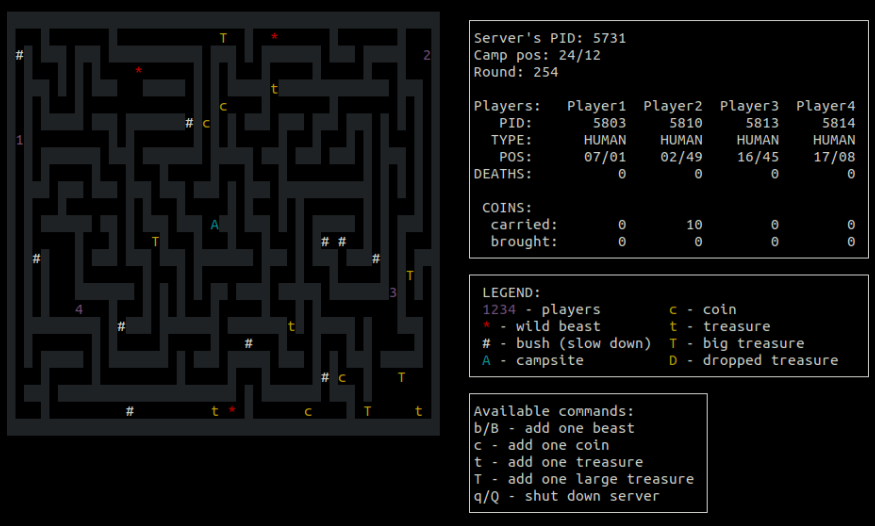
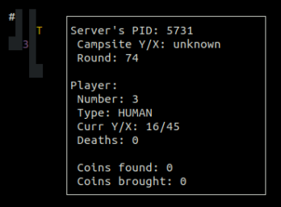

# C-multiplayer-game :video_game:
## About :mag:  
A client-server app made as a project for operating systems course.  
It's a multiplayer game where up to 4 players explore a maze and try to collect as many treasures as they can, avoiding beasts and other players.
Connection is handled using FIFO. Game can be played on one computer.  

## Requirements :heavy_exclamation_mark:
Due to usage of libraries that are available only on UNIX, this game cannot be played on Windows.  
These libraries include:
- ncurses
- pthread

## How to play :question:
### Starting the app
There are 2 directories: player and server. Open server directory in one terminal and player in another.  
Both contain a makefile which can be executed using the ```make``` command.  
Doing so will generate a ```server``` and ```player``` executable files.  
Simply type ```./{name_of_ex_file}``` to start programs.

### Rules
From server perspective you can run a bunch of commands which are described in the app itself (and on the screenshots below).  
The goal of each player is to collect as many coins as possible.  
There are 3 types of collectibles:
- c (1 coin)
- t (10 coins)
- T (50 coins)
- D (dropped treasure, amount is equal to coins carried by a player upon death)  

However, the coins can be lost if:
- player is killed by a beast
- player has a collision with another player  
Each collected treasure must be brought to the camp in the center of the map. After that, it can't be lost.   
Players move using the ```W S A D``` keys.

## Screenshots :camera:

### Server's perspective:  
<kbd></kbd>  

### Client's perspective:  
<kbd></kbd>

